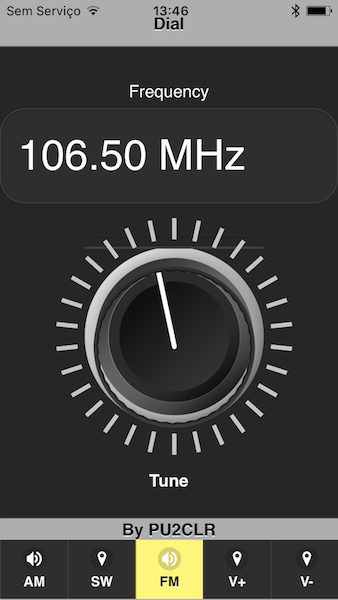
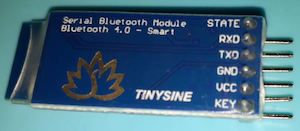
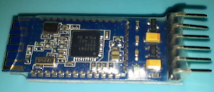
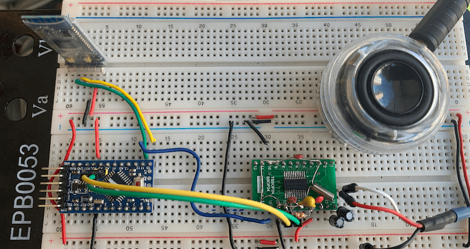

# [Android and iOS Bluetooth Remote Control for PU2CLR Arduino Library DSP receivers](https://pu2clr.github.io/bluetooth_remote_control/) 

This project is an extension of the Arduino library projects for: [SI4735](https://pu2clr.github.io/SI4735/); [AKC6959](https://pu2clr.github.io/AKC695X/) and [KT0915](https://pu2clr.github.io/KT0915/).

It is a simple example that shows a way to use your smartphone as a remote control via Bluetooth. In order to follow the steps presented here, I am assuming that you have some knowledge in development for mobile devices. Also, you will need to be familiar with the Javascript programming language.

The development environment used by this project is the [Apache Cordova](https://cordova.apache.org/docs/en/latest/guide/overview/index.html). Cordova is a open-source mobile development framework that allows you to develop cross-platform applications. That means you can code once and deploy the application in many system, including iOS and Android. 
Cordova provides an easy way to develop for iOS and Android.

__This project can be freely distributed using the MIT Free Software model__. 

[Copyright (c) 2020 Ricardo Lima Caratti](https://pu2clr.github.io/bluetooth_remote_control/#mit-license).

## Contents

1. [Mobile Application based on Cordova source code](https://github.com/pu2clr/bluetooth_remote_control/tree/master/mobile_application)
2. [Sketch example source code](https://github.com/pu2clr/bluetooth_remote_control/tree/master/si4735_sketch)
3. [Arduino Shield Bluetooth (HM10 - HMSOft TineSine)](https://pu2clr.github.io/bluetooth_remote_control/#arduino-shield-bluetooth-hm10---hmsoft-tinesine)
4. [Schematic](https://pu2clr.github.io/bluetooth_remote_control/#schematic)
5. [Extra folder](https://github.com/pu2clr/bluetooth_remote_control/tree/master/extras)
6. [Compiling de Deploying the Mobile Application](https://pu2clr.github.io/bluetooth_remote_control/#compile-and-deploy-this-mobile-application-example)

## MIT License 

Copyright (c) 2020 Ricardo Lima Caratti

Permission is hereby granted, free of charge, to any person obtaining a copy of this software and associated documentation files (the "Software"), to deal in the Software without restriction, including without limitation the rights to use, copy, modify, merge, publish, distribute, sublicense, and/or sell copies of the Software, and to permit persons to whom the Software is furnished to do so, subject to the following conditions:

The above copyright notice and this permission notice shall be included in all copies or substantial portions of the Software.

THE SOFTWARE IS PROVIDED "AS IS", WITHOUT WARRANTY OF ANY KIND, EXPRESS OR IMPLIED, INCLUDING BUT NOT LIMITED TO THE ARRANTIES OF MERCHANTABILITY, FITNESS FOR A PARTICULAR PURPOSE AND NONINFRINGEMENT. IN NO EVENT SHALL THE AUTHORS OR COPYRIGHT HOLDERS BE LIABLE FOR ANY CLAIM, DAMAGES OR OTHER LIABILITY, WHETHER IN AN ACTION OF CONTRACT, TORT OR OTHERWISE, ARISING FROM, OUT OF OR IN CONNECTION WITH THE SOFTWARE OR THE USE OR OTHER DEALINGS IN THE SOFTWARE.

## Demo video 

The video below shows you this project working. 



[Watch on youtube](https://youtu.be/Yc9DHl7yQZ0)

### Mobile device

This example uses an old iPhone 5C. However, you can use your current iOs or Android device to run it. Thanks to Cordova development environment, you can do it with no code changes.

The screenshot below shows the mobile application interface. 

  

  

### Arduino Shield Bluetooth (HM10 - HMSOft TineSine)

The Bluetooth 4.0 used here is the HM10 (TinySine). It is very similar to the famous HC-05. The photos below show the HM10 Bluetooth. This kind of Bluetooth works well on iOs and Android based device. __You also can use the HC-05 Bluetooth device. However, the HC-05 will not work on iOS devices__. 

 

|  Ponto 1 | Photo 2 | 
| -------- | ------- |
|  |  |

 

#### HM10 Documentation

* [HM-10 Bluetooth 4 BLE Modules - Martyn Currey](http://www.martyncurrey.com/hm-10-bluetooth-4ble-modules/)
* [BLE CENTRAL - HM-10 BLE Module](http://blog.blecentral.com/2015/05/05/hm-10-peripheral/)

## Bluetooth Arduino Library 

The Arduino sketch of this example uses the [SoftwareSerial](https://github.com/PaulStoffregen/SoftwareSerial) library. You have to download and install this library on your Arduino enviroment.    

## The prototype

The photos below show the Arduino, SI4735 and the Bluetooth devices connections. 

### Homebrew Si4735 shield

The photo below shows a homebrew version of the SI4735-D60 citcuit with all basic components connected on a SSOP24 board adapter. You need 3 wires to connect the Arduino to the Si4735 board (SDIO, SCLK and RESET). You also can use the Arduino board to power the homebrew SI4745 shield. 

[Click here for more details about this shield and SI4735 Arduino library](https://pu2clr.github.io/SI4735/) 

### SI4735 homebrew shield and Arduino Pro Mini/3.3V/8MHz

The tables below show the wire and pin  connections between the Arduino Board and SI4735 and Bluetooth shields.

| Si4735 pin      |  Arduino Pin  |
| ----------------| ------------  |
| RESET (pin 15)  |     12        |
| SDIO (pin 18)   |     A4        |
| SCLK (pin 17)   |     A5        |

### Bluetooth shield and Arduino Pro Mini/3.3V/8MHz
    
| BLE-HM10        |  Arduino Pin  |
| ----------------| ------------  |
| TXD             |     10        |
| RXD             |     11        |

## SCHEMATIC

The schematic below shows a very simple Arduino, SI4735 and Bluetooth shield setup. 

__You can use the HC-05 or HC-07 Bluetooth devices instead HM10 on Android based mobile devices. However, these devices will not work on iOS devices__.   

## Compiling de Deploying the Mobile Application

Copy this example folder to a local folder and follow the steps bellow.

For Android, is recommended to install [Android Studio](http://developer.android.com/sdk/index.html) on your computer to compile and deploy this application. 

For iOS (iPhone or iPad), is recommended to install [Xcode](https://developer.apple.com/xcode/) on your Mac computer to compile and deploy this application.

### Cordova 

This applications was build using the [Apache Cordova](https://cordova.apache.org/docs/en/latest/guide/overview/index.html). Click [here](https://cordova.apache.org/docs/en/latest/guide/overview/index.html) to see more about Apache Cordova.

Before star installing Cordova you have to install [npm - a software Package Manager and Installer](https://nodejs.dev/learn/how-to-install-nodejs) (Node.js Package Manager). 

### Install Cordova

    $ npm install cordova -g

### Install Platform and Plugin

    $ cordova platform add android
    $ cordova platform add ios
    $ cordova plugin add cordova-plugin-bluetooth-serial

### Build and Deploy

Compile and run the application

    $ cordova run android --device

## Videos 

- [Si4735 receiver prototype controlled by iPhone via Bluetooth](https://youtu.be/Yc9DHl7yQZ0)

## More Arduino Projects by author 

* [PU2CLR Si4735 Library for Arduino](https://pu2clr.github.io/SI4735/). This library was built based on “Si47XX PROGRAMMING GUIDE; AN332” and it has support to FM, AM and SSB modes (LW, MW and SW). It also can be used on all members of the SI47XX family respecting, of course, the features available for each IC version;
* [PU2CLR SI4844 Arduino Library](https://pu2clr.github.io/SI4844). This is an Arduino library for the SI4844, BROADCAST ANALOG TUNING DIGITAL * DISPLAY AM/FM/SW RADIO RECEIVER,  IC from Silicon Labs.  It is available on Arduino IDE. This library is intended to provide an easier interface for controlling the SI4844.
* [PU2CLR AKC695X Arduino Library](https://pu2clr.github.io/AKC695X/). The AKC695X is a family of IC DSP receiver from AKC technology. The AKC6955 and AKC6959sx support AM and FM modes. On AM mode the AKC6955 and AKC6959sx work on LW, MW and SW. On FM mode they work from 64MHz to 222MHz.
* [PU2CLR KT0915 Arduino Library](https://pu2clr.github.io/KT0915/). The KT0915 is a full band AM (LW, MW and SW) and FM DSP receiver that can provide you a easy way to build a high quality radio with low cost.
* [PU2CLR BK108X](https://pu2clr.github.io/BK108X/). The BK1086 and BK1088 are DSP receivers from BAKEN. The BK1088 is a BROADCAST FM and AM (LW, MW and ) RECEIVER and BK1086 is a subset of the BK1088 (it does not have LW and SW acording to the Datasheet).
* [PU2CLR RDA5807 Arduino Library](https://pu2clr.github.io/RDA5807/). The RDA5807 is a FM DSP integrated circuit receiver (50 to 115MHz) with low noise amplifier support. This device requires very few external components if compared with other similar devices. It also supports RDS/RBDS functionalities, direct auto gain control (AGC) and real time adaptive noise cancellation function.
* [PU2CLR SI470X Arduino Library](https://pu2clr.github.io/SI470X/). It is a Silicon Labs device family that integrates the complete functionalities for FM receivers, including RDS (Si4703).
* [PU2CLR MCP23008](https://pu2clr.github.io/MCP23008/). It is an Arduino Library to control the MCP23008/MCP23S08 8-Bit I/O Expander. The MCP23008 device provides 8-bit, general purpose, parallel I/O expansion. It can be controlled via I2C bus applications. It is a great and inexpensive device that allow you to add more devices to be controlled by your Arduino board via I2C protocol.
* [PU2CLR - PCF8574 Arduino Library](https://pu2clr.github.io/PCF8574/). It is an Arduino Library to control the PCF8574 8-Bit I/O Expander. The PCF8574 device provides 8-bit, general purpose, parallel I/O expansion. It can be controlled via I²C bus applications. It is a great and inexpensive device that allow you to add more peripherals to be controlled by your Arduino board via I²C protocol.
* [Multipurpose signal generator with SI5351](https://pu2clr.github.io/SI5351/). It is a multipurpose signal generator controlled by Arduino. This project uses the SI5351 from Silicon Labs. The Arduino sketch is configured to control the SI5351 with three channels from 32.768KHz to 160MHz and steps from 1Hz to 1MHz.
* [Shortwave Arduino Transmiter](https://pu2clr.github.io/Small-Shortwave-Transmitter/). This project is about a shortwave transmitter from 3 MHz to 30 MHz. It uses the SI5351 oscillator from Silicon Labs controlled by Arduino. Also, you can use it with a crystal oscillator. In this case, you will not need the SI5351 device and Arduino. 
* [Band Pass Filter controlled by Arduino](https://pu2clr.github.io/auto_bpf_arduino/). It is a HF band pass filter controlled by Arduino. It is designed for HF receivers. With this project, you can use a set of up to four HF bandpass filters that can be selected by Arduino. To do that you will need just two digital Arduino pins.

#### References

* [Apache Cordova](https://cordova.apache.org/docs/en/latest/guide/overview/index.html)
* [Bluetooth Serial Plugin for PhoneGap](https://www.npmjs.com/package/cordova-plugin-bluetooth-serial)
* [Bluetooth Serial Plugin for PhoneGap - github](https://github.com/don/BluetoothSerial)
* [UI Plugin For Seven-Segment Indicator - sevenSeg.js](https://www.jqueryscript.net/demo/jQuery-jQuery-UI-Plugin-For-Seven-Segment-Indicator-sevenSeg-js/)
* [HM-10 Bluetooth 4 BLE Modules - Martyn Currey](http://www.martyncurrey.com/hm-10-bluetooth-4ble-modules/)
* [BLE CENTRAL - HM-10 BLE Module](http://blog.blecentral.com/2015/05/05/hm-10-peripheral/)

