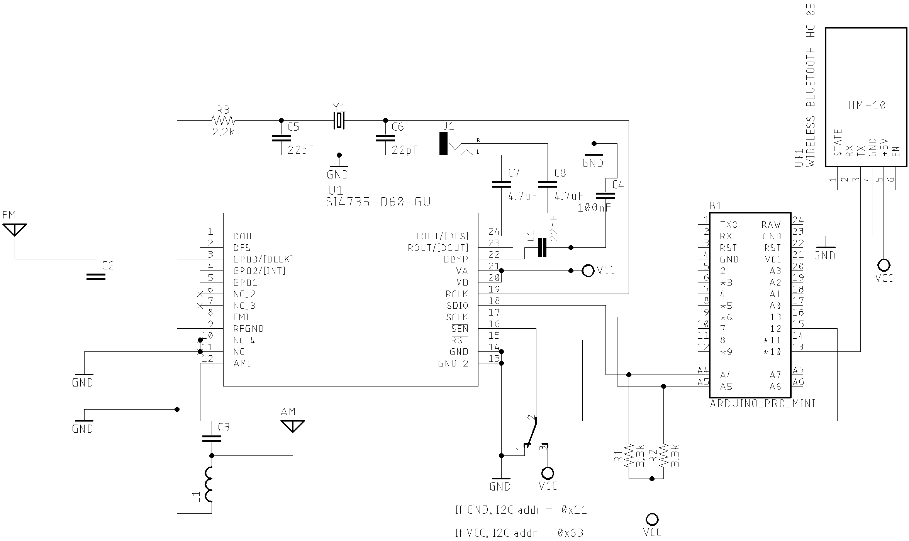

# [Android and iOS Remote Control for PU2CLR Arduino Library DSP receivers](https://pu2clr.github.io/bluetooth_remote_control/) 

This project is an extension of the Arduino library projects for: [SI4735](https://pu2clr.github.io/SI4735/); [AKC6959](https://pu2clr.github.io/AKC695X/) and [KT0915](https://pu2clr.github.io/KT0915/).

It is a simple example that shows a way to use your smartphone as a remote control via Bluetooth. In order to follow the steps presented here, I am assuming that you have some knowledge in development for mobile devices. Also, you will need to be familiar with the Javascript programming language.

The development environment used by this project is the [Apache Cordova](https://cordova.apache.org/docs/en/latest/guide/overview/index.html). Cordova is a open-source mobile development framework that allows you to develop cross-platform applications. That means you can code once and deploy the application in many system, including iOS and Android. 
Cordova provides an easy way to develop for iOS and Android.

__This project can be freely distributed using the MIT Free Software model__. 

[Copyright (c) 2020 Ricardo Lima Caratti](https://pu2clr.github.io/bluetooth_remote_control/#mit-license).

## Contents

1. [Mobile Application based on Cordova source code](https://github.com/pu2clr/bluetooth_remote_control/tree/master/mobile_application)
2. [Sketch example source code](https://github.com/pu2clr/bluetooth_remote_control/tree/master/si4735_sketch)
3. [Arduino Shield Bluetooth (HM10 - HMSOft TineSine)](https://pu2clr.github.io/bluetooth_remote_control/#arduino-shield-bluetooth-hm10---hmsoft-tinesine)
4. [Schematic](https://pu2clr.github.io/bluetooth_remote_control/#schematic)
5. [Extra folder](https://github.com/pu2clr/bluetooth_remote_control/tree/master/extras)
6. [Compiling de Deploying the Mobile Application](https://pu2clr.github.io/bluetooth_remote_control/#compile-and-deploy-this-mobile-application-example)

## MIT License 

Copyright (c) 2020 Ricardo Lima Caratti

Permission is hereby granted, free of charge, to any person obtaining a copy of this software and associated documentation files (the "Software"), to deal in the Software without restriction, including without limitation the rights to use, copy, modify, merge, publish, distribute, sublicense, and/or sell copies of the Software, and to permit persons to whom the Software is furnished to do so, subject to the following conditions:

The above copyright notice and this permission notice shall be included in all copies or substantial portions of the Software.

THE SOFTWARE IS PROVIDED "AS IS", WITHOUT WARRANTY OF ANY KIND, EXPRESS OR IMPLIED, INCLUDING BUT NOT LIMITED TO THE ARRANTIES OF MERCHANTABILITY, FITNESS FOR A PARTICULAR PURPOSE AND NONINFRINGEMENT. IN NO EVENT SHALL THE AUTHORS OR COPYRIGHT HOLDERS BE LIABLE FOR ANY CLAIM, DAMAGES OR OTHER LIABILITY, WHETHER IN AN ACTION OF CONTRACT, TORT OR OTHERWISE, ARISING FROM, OUT OF OR IN CONNECTION WITH THE SOFTWARE OR THE USE OR OTHER DEALINGS IN THE SOFTWARE.

## Demo video 

The video below shows you this project working. 



[Watch on youtube](https://youtu.be/Yc9DHl7yQZ0)

### Mobile device

This example uses an old iPhone 5C. However, you can use your current iOs or Android device to run it. Thanks to Cordova development environment, you can do it with no code changes.

The screenshot below shows the mobile application interface. 

  

  

### Arduino Shield Bluetooth (HM10 - HMSOft TineSine)

The Bluetooth 4.0 used here is the HM10 (TinySine). It is very similar to the famous HC-05. The photos below show the HM10 Bluetooth. This kind of Bluetooth works well on iOs and Android based device. __You also can use the HC-05 Bluetooth device. However, the HC-05 will not work on iOS devices__. 

 

|  Ponto 1 | Photo 2 | 
| -------- | ------- |
|  |  |

 

#### HM10 Documentation

* [HM-10 Bluetooth 4 BLE Modules - Martyn Currey](http://www.martyncurrey.com/hm-10-bluetooth-4ble-modules/)
* [BLE CENTRAL - HM-10 BLE Module](http://blog.blecentral.com/2015/05/05/hm-10-peripheral/)

## Bluetooth Arduino Library 

The Arduino sketch of this example uses the [SoftwareSerial](https://github.com/PaulStoffregen/SoftwareSerial) library. You have to download and install this library on your Arduino enviroment.    

## The prototype

The photos below show the Arduino, SI4735 and the Bluetooth devices connections. 

### Homebrew Si4735 shield

The photo below shows a homebrew version of the SI4735-D60 citcuit with all basic components connected on a SSOP24 board adapter. You need 3 wires to connect the Arduino to the Arduino Board (SDIO, SCLK and RESET). You also can use the Arduino board to power the homebrew SI4745 shield. 

[Click here for more details about this shield and SI4735 Arduino library](https://pu2clr.github.io/SI4735/) 

### SI4735 homebrew shield and Arduino Pro Mini/3.3V/8MHz

The tables below show the wire and pin  connections between the Arduino Board and SI4735 and Bluetooth shields.

| Si4735 pin      |  Arduino Pin  |
| ----------------| ------------  |
| RESET (pin 15)  |     12        |
| SDIO (pin 18)   |     A4        |
| SCLK (pin 17)   |     A5        |

### Bluetooth shield and Arduino Pro Mini/3.3V/8MHz
    
| BLE-HM10        |  Arduino Pin  |
| ----------------| ------------  |
| TXD             |     10        |
| RXD             |     11        |

## SCHEMATIC

The schematic below shows a very simple Arduino, SI4735 and Bluetooth shield setup. 

__You can use the HC-05 or HC-07 Bluetooth devices instead HM10 on Android based mobile devices. However, these devices will not work on iOS devices__.   

## Compiling de Deploying the Mobile Application

Copy this example folder to a local folder and follow the steps bellow.

For Android, is recommended to install [Android Studio](http://developer.android.com/sdk/index.html) on your computer to compile and deploy this application. 

For iOS (iPhone or iPad), is recommended to install [Xcode](https://developer.apple.com/xcode/) on your Mac computer to compile and deploy this application.

### Cordova 

This applications was build using the [Apache Cordova](https://cordova.apache.org/docs/en/latest/guide/overview/index.html). Click [here](https://cordova.apache.org/docs/en/latest/guide/overview/index.html) to see more about Apache Cordova.

### Install Cordova

    $ npm install cordova -g

### Install Platform and Plugin

    $ cordova platform add android
    $ cordova platform add ios
    $ cordova plugin add cordova-plugin-bluetooth-serial

### Build and Deploy

Compile and run the application

    $ cordova run android --device

## Videos 

- [Si4735 receiver prototype controlled by iPhone via Bluetooth](https://youtu.be/Yc9DHl7yQZ0)

#### References

* [Apache Cordova](https://cordova.apache.org/docs/en/latest/guide/overview/index.html)
* [Bluetooth Serial Plugin for PhoneGap](https://www.npmjs.com/package/cordova-plugin-bluetooth-serial)
* [Bluetooth Serial Plugin for PhoneGap - github](https://github.com/don/BluetoothSerial)
* [UI Plugin For Seven-Segment Indicator - sevenSeg.js](https://www.jqueryscript.net/demo/jQuery-jQuery-UI-Plugin-For-Seven-Segment-Indicator-sevenSeg-js/)
* [HM-10 Bluetooth 4 BLE Modules - Martyn Currey](http://www.martyncurrey.com/hm-10-bluetooth-4ble-modules/)
* [BLE CENTRAL - HM-10 BLE Module](http://blog.blecentral.com/2015/05/05/hm-10-peripheral/)

